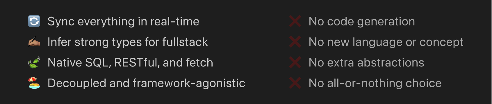

# withtyped

[](https://github.com/withtyped/withtyped/actions?query=branch%3Amaster)
[](https://app.codecov.io/gh/withtyped/withtyped)
[](https://github.com/withtyped/withtyped/releases)

> **Note**
> This project is in the beta stage and things are subject to change.

Write native SQL-in-TS and get 4 tailored dev engines with no time:

1. A database initializer
2. A RESTful API service
3. A type-safe client
4. An dynamic OpenAPI endpoint

## Highlights



This README focus on features and use cases, see [/docs](./docs) folder for reference.

## Get started

No one wants to waste time on those repeating works and syncing across database, backend, frontend, and docs.

Instead of adding "another layer of abstraction", how about the native way?

### Install packages

```bash
# In server project
npm i @withtyped/{server,postgres} # Could also be MySQL or other adapters, pending development

# In client (frontend/backend) project, can be a different one from server
npm i @withtyped/client
```

### Write SQL-in-TS

Just write the native SQL in a TypeScript file and create a database query client:

```ts
import { createModel } from '@withtyped/server';
import { createQueryClient } from '@withtyped/postgres';

const Book = createModel(`
  create table books (
    id varchar(128) not null,
    name varchar(128) not null,
    authors jsonb not null default '[]',
    created_at timestamptz not null default(now()),
    primary key (id)
  );
`);

const queryClient = createQueryClient({ database: 'your-db-name' }); // Pass a `node-pg` config object
```

Instantly you can have:

### A database initializer

```ts
import { PostgresInitializer } from '@withtyped/postgres';

const initClient = new PostgresInitializer([Book], queryClient);
await initClient.initialize(); // Create a database if needed, then create tables
```

### A RESTful API service

```ts
import { createModelRouter } from '@withtyped/postgres';
import createServer from '@withtyped/server';
import { createComposer } from '@withtyped/server/lib/preset.js';

const modelRouter = createModelRouter(Book, queryClient).withCrud(); // Magic happens here
const server = createServer({
  queryClients: [queryClient],
  composer: createComposer().and(modelRouter.routes()),
});
await server.listen();
```

Available APIs:

```
GET /books, /books/:id
POST /books
PUT /books/:id
PATCH /books/:id
DELETE /books/:id
```

### A type-safe client

In client project:

```ts
import Client from '@withtyped/client';
import type { modelRouter } from 'path/to/server.js'; // Don't worry, just types

const client = new Client<typeof modelRouter>('http://localhost:9001');

client.get('/apple'); // TypeError: No route found
client.get('/book/:id'); // TypeError: Route requires parameter `id`
client.get('/books/:id', { params: { id: 'book-1' } }); // Promise<Book>
client.post('/books', { body: { id: 'book-1', name: 'Pale Fire', ... } }); // Promise<Book>
```

### An dynamic OpenAPI endpoint

```ts
// Server
modelRouter.withOpenApi();

// Client
client.get('/openapi.json'); // Promise<OpenAPIV3.Document>
```

## Extend routes

Besides the normal CRUD, you can freely extend any routes:

```ts
modelRouter
  .withCrud()
  .get('/another', {}, (context, next) => {})
  .put('/:id/secret', {}, (context, next) => {});
```

Or merge multiple routers:

```ts
const router = createRouter()
  .pack(modelRouter1)
  .pack(modelRouter2)
  .pack(modelRouter3)
  .withOpenApi();
```

See [Router docs](./docs/server.md#router) for details.

## What if I just want to use...

The withtyped components work seamlessly together, while every single piece can be used separately.

### A middleware-based HTTP server

The HTTP server is similar to the concept of KoaJS, but with typed and immutable context (say goodbye to `ctx.body = {}`, huh):

```ts
import createServer, { compose, MiddlewareFunction } from '@withtyped/server';

const server = createServer({ composer: compose(fn1).and(fn2).and(fn3) });

// Middleware function
const fn1: MiddlewareFunction = async (context, next) => {
  return { ...context, status: 404 };
  return { ...context, status1: 404 }; // TypeError: `status1` does not exist in type `BaseContext`
}
```

### A typed RESTful router

Guard input and output with Zod:

#### Router with server

```ts
import createServer, { Router, RequestError } from '@withtyped/server';
import { createComposer } from '@withtyped/server/lib/preset.js'; // Essential middleware functions preset
import { z } from 'zod';

export const bookGuard = z.object({
  id: z.string(),
  name: z.string(),
  // ...
});

export const router = new Router()
  .get( // post, patch, delete, ...
    '/books/:id', // Path segments starts with `:` will be transformed into parameter and store in `context.request.params`
    {
      response: bookGuard, // Guard response
    },
    async (context, next) => {
      const book = await findBookById(context.request.params.id);

      return next({ ...context, json: book }); // OK if type of `book` matches bookGuard
      return next({ ...context, json: {} }); // Not OK
    }
  )
  .post(
    '/test',
    { 
      query: z.object({ name: z.string() }), // Requires `name` presents in the query string, e.g. `/test?name=Pale%20Fire`
      body: z.object({ books: bookGuard.array() }) // Requires body to have an array of books
    },
    async (context, next) => {
      const { query, body } = context.request; // Typed!
      throw new RequestError('Alright thanks', 400); // Feel free to throw error with status code
    }
  )

// Call `router.routes()` to get the middleware function
const server = createServer({ composer: createComposer().and(router.routes()) }); // Go

server.listen((port) => {
  console.log('Listening', port); // Server default port
});
```

#### Client

With the router above, in your client project:

```ts
import type { router } from 'path/to/server.js'; // Don't worry, just types

const client = new Client<typeof router>('http://localhost:9001'); // Init with magic

client.get('/apple'); // TypeError: No route found
client.get('/book/:id'); // TypeError: Route requires parameter `id`
client.get('/books/:id', { params: { id: 'book-1' } }); // Promise<Book>
```

## Reference

See [/docs](./docs) folder for reference.

## Possible future plans

- Database schema alteration management
- Integrated auth with [Logto](https://github.com/logto-io/logto)

## Credit

Heavily inspired by [trpc](https://github.com/trpc/trpc) and [KoaJS](https://github.com/koajs/koa). They are great projects:

- The way trpc syncs types between server and client is genius
- Love the concept of middleware functions in KoaJS

But still have some pain points:

- Existing services and components are mainly based on RESTful, hard to gradually migrate to a new framework
- KoaJS is written in JavaScript and its ecosystem lacks of maintenance
