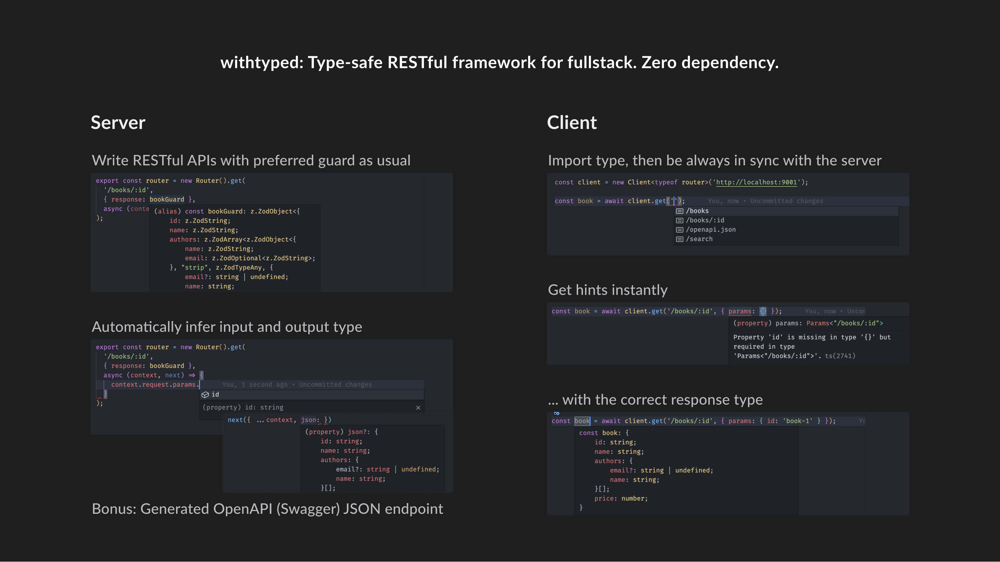

# withtyped

> NOTE
> This project is in the experimental stage and has a lot of work to do. Don't use it in prod.



- 😄 No mind-switch, still RESTful
- 🎁 Write typed APIs, get a typed client free
- 🛡️ Guard request input (path params, query, body) and output (response)
- ⚪ Minimalism, zero dependency and framework-agnostic (Use any parser or `fetch` polyfill if needed)
- 📖 Auto OpenAPI JSON generation[^openapi]

## Even without APIs...

- Withtyped is a succinct web framework with fully typed middleware functions
- Immutable context (say goodbye to `ctx.body = {}`, huh), clean and clear in every step

## (Simple) docs

### Installation

```bash
npm i @withtyped/server # In API server project
npm i @withtyped/client # In client (frontend/backend) project, can be a different one from server
```

### Server

```ts
import createServer from '@withtyped/server';
import { createComposer } from '@withtyped/server/lib/preset.js'; // Essential middleware functions preset
import Router from '@withtyped/server/lib/router/index.js'; // Server router
import RequestError from '@withtyped/server/lib/errors/RequestError.js';
import { z } from 'zod';

export const bookGuard = z.object({ // Use Zod as data parser, can replace with Yup, Joi, whatsoever
  id: z.string(),
  name: z.string(),
  // ...
});

export const router = new Router()
  .get( // post, patch, delete, ...
    '/books/:id', // Path segments starts with `:` will be transformed into parameter and store in `context.request.parameter`
    {
      response: bookGuard, // Guard response
    },
    async (context, next) => {
      const book = await findBookById(context.request.params.id);

      return next({ ...context, json: book }); // OK if type of `book` matches bookGuard
      return next({ ...context, json: {} }); // Not OK
    }
  )
  .post(
    '/test',
    { 
      query: z.object({ name: z.string() }), // Requires `name` presents in the query string, e.g. `/test?name=Pale%20Fire`
      body: z.object({ books: bookGuard.array() }) // Requires body to have an array of books
    },
    async (context, next) => {
      const { query, body } = context.request; // Typed!
      throw new RequestError('Alright thanks', 400); // Feel free to throw error with status code
    }
  )

// Call `router.routes()` to get the middleware function
// Use `composer.and(function1).and(function2)` to chain middleware functions
const server = createServer({ composer: createComposer().and(router.routes()) }); // Go

server.listen(() => {
  console.log('Listening', 9001); // Server default port
});
```

### Client

```ts
import type { router } from './server.js'; // Don't worry, just types

const client = new Client<typeof router>('http://localhost:9001'); // Init with magic

client.get('/apple'); // TypeError: No route found
client.get('/book/:id'); // TypeError: Route requires parameter `id`
client.get('/books/:id', { params: { id: 'book-1' } }); // Promise<Book>
```

See `debug.ts` (server) and `debug-test.ts` (client) in the [sample project](./packages/sample/src/) for detailed interaction between server and client.

### Run tests

Prerequisite: PNPM >= 7, Node >= 18

```bash
# Install dev dependencies and build
pnpm i && pnpm -r build

# Start the server
cd packages/sample
node lib/debug.js

# In another terminal
cd packages/sample
node --test
```

## Other usages

### Generate OpenAPI (Swagger) JSON endpoint

```ts
// Server
router.withOpenApi(parserToParameters, parserToSchema); // Given a parser, output OpenAPI Parameters or Schema

// Client
client.get('/openapi.json'); // Promise<OpenAPIV3.Document>
```

See [sample project server](./packages/sample/src/debug.ts) for details.

### Custom middleware functions

Like KoaJS, everything is middleware. Use `compose()` to chain functions:

```ts
import compose from '@withtyped/server/lib/compose.js';

compose(function1).and(function2).and(function3); // Still a middleware function
compose().and(function1).and(function2).and(function3); // Same as above
```

### Normal web server

See [sample file](./packages/sample/src/index.ts) for how to use withtyped as a normal web server without routes.

## Credit

Heavily inspired by [trpc](https://github.com/trpc/trpc) and [KoaJS](https://github.com/koajs/koa). They are great projects:

- The way trpc syncs types between server and client is genius
- Love the concept of middleware functions in KoaJS

But still have some pain points:

- Existing services and components are mainly based on RESTful, hard to gradually migrate to a new framework
- KoaJS is written in JavaScript and its ecosystem lacks of maintenance

[^openapi]: Needs a simple transformer function that parses your type guard to OpenAPI schema. See [sample project](./packages/sample/src) for details.

## Future (not sure)

- Make it for prod use
- Infer CRUD APIs from a single type definition
