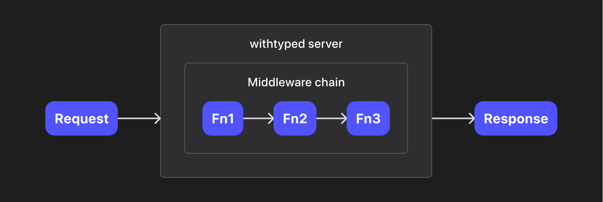

# Server docs

Location: [/packages/server](/packages/server)

NPM package: `@withtyped/server`

**Table of contents**

- [Summary](#summary)
- [Factories](#factories)
  - [`createServer()`](#createserver)
  - [`createRouter()`](#createrouter)
  - [Composer preset](#composer-preset)
  - [`compose()`](#compose)
- [Types](#types)
  - [`MiddlewareFunction`](#middlewarefunction)
  - [Context](#context)
  - [`Composer`](#composer)
- [Middleware functions](#middleware-functions)
  - [`withRequest()`](#withrequest)
  - [`withBody()`](#withbody)
  - [`withCors()`](#withcors)
- [Router](#router)
  - [Create a router](#create-a-router)
  - [`[method]()`](#method)
  - [`pack()`](#pack)
  - [`routes()`](#routes)
  - [`withOpenApi()`](#withopenapi)
- [Model](#model)
  - [Create a model](#create-a-model)
  - [`.extend()`](#extend)
  - [`.parse()`](#parse)
- [Abstract classes](#abstract-classes)

## Summary

This package is the core of the withtyped server. It provides:

- Factories and utilities to create and run a server
- Interfaces and abstract classes for database-related implementation
  - Current official implementation: [Postgres](./postgres.md)

The main concept is simple:



Use `createServer()` to create a withtyped server and `compose()` to create the middleware chain.

## Factories

### `createServer()`

**Call signature** `createServer(config?: CreateServer): ServerObject`

```ts
type CreateServer = {
  /** Port to listen, default to 9001. */
  port?: number;
  /** The middleware composer to execute. */
  composer?: Composer<T, InputContext, OutputContext>;
  /** An array of query clients. The server will automatically init these clients in `listen()` and end these clients when server closing. */
  queryClients?: QueryClient[];
  /** Use 'none' to turn off the log. */
  logLevel?: 'none' | 'info';
};

type ServerObject = {
  /** Shut down all query clients and the server. */
  close: (() => Promise<void>);
  /** Start all query clients and the server in order. */
  listen: ((listener?: ((port: number) => void)) => Promise<void>);
  server: Server;
};
```

### `createRouter()`

**Call signature** `createRouter(prefix?: string): Router`

Create a `Router` instance with the given prefix (optional). Note the prefix should be [normalized](#prefix-should-be-normalized).

#### Related

Router

### Composer preset

**Import path** `'@withtyped/server/lib/preset.js'`

**Call signature** `createComposer(): Composer`

Create a composer with preset middleware functions `withRequest()` and `withBody()`.

### `compose()`

**Call signature** `compose(middleware?: MiddlewareFunction): Composer`

Create a chainable composer with the given middleware function. Call `.and()` of the composer to chain another middleware function.

E.g.: `compose(fn1).and(fn2).and(fn3)`

Each composer itself is a middleware function object, i.e. it has the same call signature as a normal middleware function.

## Types

### `MiddlewareFunction`

As long as it's a middleware function, it can be chained and executed in withtyped.

```ts
export type MiddlewareFunction<
  InputContext extends BaseContext = BaseContext,
  OutputContext extends BaseContext = InputContext
> = (context: InputContext, next: NextFunction<OutputContext>, http: HttpContext) => Promise<void>;

export type NextFunction<Context extends BaseContext> = (
  context: Readonly<Context>
) => Promise<void>;

export type HttpContext = {
  request: IncomingMessage;
  response: ServerResponse;
};
```

#### Context transformation

A middleware function has an input context and an output context. The function take the input context, do some jobs, and execute `next()` with the output context.

For example, `withRequest()` can take a base context and transform it to a request context with useful request info:

```ts
type RequestContext = BaseContext & {
  request: { method?: RequestMethod; headers: IncomingHttpHeaders; url: URL; body?: unknown };
};
```

Note the output can be totally different form the input:

```ts
type InputContext = BaseContent & { foo: number };
type OutputContext = BaseContent & { bar: string };
const fn: MiddlewareFunction<InputContext, OutputContext>; // OK
```

Usually both of the context types can be automatically inferred, so no need for providing explicit generic arguments.

#### `NextFunction`

Calling `next()` function with the new context to proceed to the next middleware. You can only call `next()` once per middleware function.

The context is always readonly, so you need to provide a new object for the new context (can be a shallow copy):

```ts
next({ ...context, newField: 'value' });
```

Or pass the original context if no context change:

```ts
next(context);
```

#### `HttpContext`

For other advanced needs, the original `request` and `response` can be found in the third parameter.

### Context

All middleware contexts have a common base type `BaseContext`:

```ts
type BaseContext = {
  /** A dictionary to put request info. Use `withRequest()` and `withBody()` to set it automatically. */
  request?: Record<string, unknown>;
  /** The response status number. Default to 404. */
  status?: number;
  /** The response json object. */
  json?: unknown;
  /** The response (outgoing) headers */
  headers?: OutgoingHttpHeaders;
};
```

#### Context input

Base context is just a type for key restriction, the initial middleware function will receive an empty object `{}` as the input context.

You can use `withRequest()` and `withBody()` to obtain request info.

#### Context output

After executing the last middleware function, withtyped will read `status`, `json`, and `headers` from the last output context and send the response properly.

### `Composer`

```ts
export type Composer<
  MiddlewareFunctions extends unknown[],
  InputContext extends BaseContext,
  OutputContext extends BaseContext
> = MiddlewareFunction<InputContext, OutputContext> &
  ComposerProperties<MiddlewareFunctions, InputContext, OutputContext>;
```

A composer is a middleware function with some enhanced utilities to make it chainable. With composer, you can chain any number of middleware functions without losing type.

```ts
type Ctx1 = BaseContext & { c1: string };
type Ctx2 = BaseContext & { c1: string; c2: number };
type Ctx3 = BaseContext & { c2: number; c3: number };

const fn1: MiddlewareFunction<Ctx1, Ctx2>;
const fn2: MiddlewareFunction<Ctx2, Ctx3>;
const fn3: MiddlewareFunction<Ctx3, Ctx1>;

compose(fn1).and(fn2) // MiddlewareFunction<Ctx1, Ctx3>
compose(fn1).and(fn2).and(fn3) // MiddlewareFunction<Ctx1, Ctx1>
compose(fn1).and(fn3) // TypeError: The output context of fn1 is not compatible with the input context of fn3
```

#### Composer properties

```ts
export type ComposerProperties = {
  functions: Readonly<MiddlewareFunctions>;
  and: (middleware: MiddlewareFunction) => Composer;
};
```

Use [compose()](#composemiddleware-middlewarefunction-composer) to create a composer and chain middleware functions.

## Middleware functions

This section includes withtyped built-in middleware functions. You can also write your own.

### `withRequest()`

**Call signature** `withRequest() => MiddlewareFunction<InputContext, WithRequestContext<InputContext>>`

Create a middleware function that extracts some useful info from `HttpContext` and inject into the context.

```ts
type WithRequestContext<InputContext> = InputContext & {
  request: { method?: RequestMethod; headers: IncomingHttpHeaders; url: URL; body?: unknown };
};
```

Alternatively, you can use `RequestContext` as your middleware function's input context:

```ts
const fn: MiddlewareFunction = (context, next) => {
  typeof context.request.url // unknown
};

const fn: MiddlewareFunction<RequestContext> = (context, next) => {
  typeof context.request.url // URL
};
```

### `withBody()`

**Call signature** `withBody() => MiddlewareFunction<InputContext, WithBodyContext<InputContext>>`

Create a middleware function that reads request body and tries to parse as JSON, inject the result into `context.request.body`. Do nothing if parse failed.

```ts
compose(withBody()).and((context, next) => {
  context.request.body // Json
});
```

### `withCors()`

**Call signature** `withCors(config?: WithCorsConfig) => MiddlewareFunction<InputContext, InputContext>`

Create a middleware function that follows the CORS policy specified.

```ts
type WithCorsConfig<T extends string> = {
  /** Default to 'adaptive' */
  allowedOrigin?: (T extends 'adaptive' | '*' ? never : T) | RegExp | 'adaptive';
  /** Default to '*' */
  allowedHeaders?: string[] | RegExp | '*';
  /** Default to '*' */
  allowedMethods?: Array<string | RequestMethod> | '*';
  /** Default to `false` */
  allowCredentials?: boolean;
  /** Default to 600 */
  maxAge?: number;
};
```

- For `allowOrigin`, we replaced `*` with `adaptive` since `*` has the limit of [using credentials](https://developer.mozilla.org/en-US/docs/Web/HTTP/Headers/Access-Control-Allow-Origin).
- Header `access-control-allow-headers`, `access-control-allow-methods`, and `access-control-max-age` present in `OPTIONS` request responses only.
- For detailed explanation of how CORS works, see MDN [CORS page](https://developer.mozilla.org/en-US/docs/Web/HTTP/CORS).

## Router

Using router class is a descriptive way to build typed RESTful APIs and even enables type-safety in client.

### Create a router

```ts
// Class constructor
const router = new Router();
// "Functional" way
const router = createRouter();
// With prefix
const router = createRouter('/books');
```

Note you can pass a prefix to the router, if so, this prefix will prepend to every route.

#### Prefix should be normalized

- Start with `/`, but not end with `/`
- Have NO continuous `/`, e.g. `/foo//bar`
- Have NO path parameter, e.g. `/:foo`

### `[method]()`

**Call signature** `[method](path: string, guard: RequestGuard<Search, Body, Response>, fn: MiddlewareFunction)`

`[method]` indicates the identical string to the lowercased HTTP method:

```ts
router.get('/', {}, (context, next) => {
  console.log('GET /');
});
```
Available methods: `get, post, put, patch, delete, copy, head, options`

The request guard is an object that guards search parameters, body, and response:

```ts
type RequestGuard<Search, Body, Response> = {
  search?: Parser<Search>;
  body?: Parser<Body>;
  response?: Parser<Response>;
};

type Parser<T> = {
  parse: (data: unknown) => T;
};
```

We'll go through the detail usage in the sections below.

#### Chain methods

Calling `[method]()` will append the route to the CURRENT router (for performance concern) and return the router with the new type.

Thus, to have a comprehensive type definition of the router, calling in a chain is preferred:

```ts
const newRouter = router
  .get('/', {...}, ...)
  .get('/:id', {...}, ...)
  .post('/', {...}, ...)
  .delete('/:id', {...}, ...);

// `newRouter` refer to the same instance of `router`,
// but with 4 new routes inside its type definition.
```

#### Path parameters

Path segment starts with `:` will be converted to a string parameter, and stores in the `request` object of the input context. E.g.:

```ts
router.get('/books/:id', {}, (context, next) => {
  typeof context.request.params.id // string
});
```

You can have multiple path parameters too:

```ts
router.get('/books/:id/:another', {}, (context, next) => {
  typeof context.request.params // { id: string, another: string }
});
```

#### Search parameters

You can guard URL search as an object with string or string array values:

```ts
// Use zod as an example, replace with your favorite
router.get(
  '/search',
  { search: z.object({ name: z.string(), years: z.string().array() }) },
  async (context, next) => {
    typeof context.request.search // { name: string; years: string[]; }
  }
);
```

If the key appeared more than once in the search parameters, it'll be treated as an array:

```
https://your.domain.com/search?name=Pale%20Fire&years=1990&years=2000
```

#### Body guard

Request body can be guarded as arbitrary JSON object:

```ts
// Use zod as an example, replace with your favorite
router.post(
  '/books',
  {
    body: z.object({
      name: z.string(),
      year: z.number(),
      authors: z.object({ name: z.string(), email: z.string().optional() }).array()
    })
  },
  async (context, next) => {
    typeof context.request.body // { name: string; year: number; authors: Array<{ name: string; email?: string }> }
  }
);
```

> **Warning**
> Router does NOT read the request body. Make sure a `withBody()` middleware function has been put in front of the router.

#### Response guard

The benefits of response guard:

- Make sure the response type is correct when calling `next()`
- Be able to generate the response info in the OpenAPI endpoint
- Higher engineering quality

```ts
router.post(
  '/books',
  {
    response: z.object({
      name: z.string(),
      year: z.number(),
      authors: z.object({ name: z.string(), email: z.string().optional() }).array()
    })
  },
  async (context, next) => {
    return next(context); // TypeError: Type of `context.json` mismatch the guard
    return next({ ...context, json: { name: 'Pale Fire', year: 1962, authors: [] } }); // OK
  }
);
```

### `pack()`

**Call signature** `pack(another: Router): Router`

Pack all routes in `another` into the current router and return the current router with the new type. The prefix of `another` will be kept.

```ts
const routerA = createRouter('/foo');
const routerB = createRouter('/bar').get('/baz', {}, ...);

routerA.pack(routerB); // Available route: `GET /foo/bar/baz`
```

### `routes()`

**Call signature** `routes(): MiddlewareFunction<RequestContext>`

Create a middleware function for withtyped server.

```ts
const routerA = createRouter('/foo');
const routerB = createRouter('/bar').get('/baz', {}, ...);

compose(routerA.routes()).and(routerB.routes()); // Available route: `GET /bar/baz`
```

### `withOpenApi()`

**Call signature**

```ts
withOpenApi(
  parseSearch?: <T>(guard?: Parser<T>) => OpenAPIV3.ParameterObject[],
  parse?: <T>(guard?: Parser<T>) => OpenAPIV3.SchemaObject,
  info?: Partial<OpenAPIV3.InfoObject>
): Router;
```

Calling this method will add a `GET /openapi.json` that returns an [OpenAPI V3 Document](/packages/server/src/openapi/openapi-types.ts) JSON of all the routes in the router.

The router will recognize withtyped `Model` and transpile it to the valid OpenAPI V3 objects.

If you are using any third-party parser/validator (Zod, Yup, Joi, etc.), even if inside the model, the first two parameters will be required to help the router of transform a parser into the OpenAPI V3 compatible objects.

See [this file](/packages/server/src/test-utils/openapi.test.ts) for an example of transforming Zod parsers.

## Model

A model includes a database schema, the TypeScript types, and a model parser.

### Create a model

Use the native SQL as you are in the database tool to create the model:

```ts
const Book = createModel(`
  create table books (
    id varchar(128) not null,
    name varchar(128) not null,
    authors jsonb not null default '[]',
    price decimal not null default 99.99,
    year int,
    created_at timestamptz not null default(now()),
    primary key id
  ); -- The ending ';' here is required for type inference
`);

const data: InferModelType<typeof Book>;
// Actual type
{
  id: string;
  name: string;
  authors: JsonObject | JsonArray;
  price: number;
  year: number | null;
  createdAt: Date;
}
```

All constraints and primary/foreign keys will be ignored.

### `.extend()`

**Call signature** `extend(key: ModelKey, parser: Parser): Model`

You may want to have customized parsers on some columns (like for `jsonb` in Postgres):

```ts
const Book = createModel(`...`)
  .extend(
    'authors',
    z.object({
      name: z.string(),
      email: z.string().optional()
    }).array()
  );

const data: InferModelType<typeof Book>;
// Actual type
{
  // ...other types
  authors: Array<{ name: string; email?: string }>;
}
```

### `.parse()`

**Call signature**

```ts
parse(data: unknown): ModelType;
parse(data: unknown, forType: 'create'): CreateType;
parse(data: unknown, forType: 'patch'): Partial<CreateType>;
```

Parse the unknown object to the desired model type. Throw an error if parse failed.

#### Difference between types

`ModelType` represents the actual data type in the database, regardless if the column has a default value.

`CreateType` represents the minimal data to provide for creating a new row, i.e. columns with default value in database can be `undefined`.

In withtyped data model, all explicit empty will be and should be `null`, while `undefined` means "to ignore".

## Abstract classes

The foundation of platform-related implementations.

WIP
